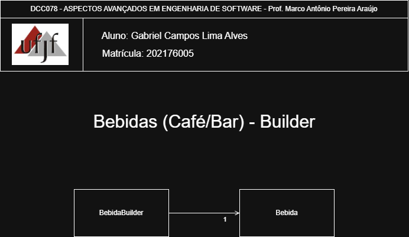

# Builder — Sistema de Construção de Bebidas

<p align="center">
	<a href="https://www.ufjf.br/" rel="noopener">
		
	</a>
</p>

<h3 align="center">DCC078-2025.3-A — Aspectos Avançados em Engenharia de Software (UFJF/ICE)</h3>

---

## 📝 Sumário
- [Sobre](#sobre)
- [Diagrama de Classe](#diagrama)
- [Funcionalidades](#funcionalidades)
- [Tecnologias](#tecnologias)
- [Exemplo de Uso](#exemplo)
- [Como Executar e Testes](#testes)
- [Autor](#autor)

## 🧐 Sobre <a name="sobre"></a>
> **Disciplina:** DCC078 – Aspectos Avançados em Engenharia de Software   </br>
> **Projeto:** Demonstração do padrão Builder em um sistema de construção de bebidas   </br>
> **Docente:** Prof. Marco Antônio Pereira Araújo  </br>
> **Data de entrega:** 18/11/2025   </br>
> **Aluno:** [Gabriel Campos Lima Alves](#autor)  </br>

### Padrão Builder
Implementação do padrão **Builder** aplicada a um sistema de construção de bebidas. O foco é simplificar a criação de objetos complexos com múltiplas propriedades opcionais, permitindo uma construção fluente e legível. Demonstra:
- Um builder fluente (`BebidaBuilder`) para construção passo a passo de bebidas
- Separação clara entre construção e representação do objeto
- Validação de propriedades obrigatórias durante a construção
- Interface fluente que facilita a leitura e compreensão do código
- Flexibilidade na definição de todas as características da bebida

## 📐 Diagrama de Classe <a name="diagrama"></a>
O diagrama abaixo representa a arquitetura do projeto, enfatizando o padrão **Builder** como construtor de objetos complexos:

<p align="center">
	
</p>
## 🚀 Funcionalidades <a name="funcionalidades"></a>
### Sistema de Construção de Bebidas
- **Bebida**: Classe que representa uma bebida com múltiplas propriedades
- **BebidaBuilder**: Builder que constrói bebidas de forma fluente e validada

### Características da Bebida
- Nome da bebida
- Tamanho (P, M, G)
- Preço
- Tipo (Quente, Fria, Gelada)
- Temperatura
- Calorias
- Descrição
- Presença de cafeína
- Presença de açúcar
- Presença de leite
- Presença de chantilly

### Recursos
- ✅ Implementação completa do padrão Builder
- ✅ Interface fluente para construção de bebidas
- ✅ Validação de propriedades obrigatórias (nome, tamanho, preço, tipo)
- ✅ Suporte a múltiplas propriedades opcionais
- ✅ Código legível e fácil de manter
- ✅ Cobertura completa de testes com JUnit 5
- ✅ Tratamento de exceções para construção inválida

## 🛠️ Tecnologias <a name="tecnologias"></a>
- **Java 11+**
- **JUnit 5** - Framework de testes
- **Maven** - Gerenciamento de dependências
- **Git** - Controle de versão

## 📊 Exemplo de Uso <a name="exemplo"></a>
```java
// Construindo uma bebida quente simples
Bebida cafe = new BebidaBuilder()
    .setNome("Café Expresso")
    .setTamanho("P")
    .setPreco(5.50)
    .setTipo("Quente")
    .setTemperatura("Quente")
    .setCalorias(50)
    .setDescricao("Expresso puro e aromático")
    .setContemCafeina(true)
    .setContemAcucar(false)
    .setContemLeite(false)
    .setContemChantilly(false)
    .build();

// Construindo uma bebida fria com múltiplos toppings
Bebida cappuccinoGelado = new BebidaBuilder()
    .setNome("Cappuccino Gelado")
    .setTamanho("M")
    .setPreco(12.90)
    .setTipo("Gelada")
    .setTemperatura("Frio")
    .setCalorias(180)
    .setDescricao("Capuccino cremoso com gelo")
    .setContemCafeina(true)
    .setContemAcucar(true)
    .setContemLeite(true)
    .setContemChantilly(true)
    .build();

// Construindo um suco natural
Bebida sucoNatural = new BebidaBuilder()
    .setNome("Suco de Laranja")
    .setTamanho("G")
    .setPreco(8.50)
    .setTipo("Fria")
    .setTemperatura("Gelado")
    .setCalorias(95)
    .setDescricao("Suco natural de laranja fresca")
    .setContemCafeina(false)
    .setContemAcucar(false)
    .setContemLeite(false)
    .setContemChantilly(false)
    .build();
**Saída esperada:**
```
Bebida: Café Expresso
Tamanho: P | Preço: R$ 5.50
Tipo: Quente | Temperatura: Quente
Calorias: 50 | Descrição: Expresso puro e aromático
Contém Cafeína: Sim | Contém Açúcar: Não
Contém Leite: Não | Contém Chantilly: Não

Bebida: Cappuccino Gelado
Tamanho: M | Preço: R$ 12.90
Tipo: Gelada | Temperatura: Frio
Calorias: 180 | Descrição: Capuccino cremoso com gelo
Contém Cafeína: Sim | Contém Açúcar: Sim
Contém Leite: Sim | Contém Chantilly: Sim

Bebida: Suco de Laranja
Tamanho: G | Preço: R$ 8.50
Tipo: Fria | Temperatura: Gelado
Calorias: 95 | Descrição: Suco natural de laranja fresca
Contém Cafeína: Não | Contém Açúcar: Não
Contém Leite: Não | Contém Chantilly: Não
```

## 🧪 Como Executar e Testes <a name="testes"></a>
### Pré-requisitos
- Java 11 ou superior
- Maven 3.6+

### Comandos
```bash
# Compilar o projeto
mvn clean compile

# Executar todos os testes
mvn test

# Executar teste específico (exemplo)
mvn test -Dtest=padroescriacao.builder.BebidaBuilderTest

# Empacotar
mvn package
```

### Testes Inclusos
- **BebidaBuilderTest**: Testes unitários cobrindo:
  - Construção válida de bebidas
  - Validação de propriedades obrigatórias
  - Tratamento de exceções
  - Diferentes combinações de propriedades
  - Interface fluente do builder

Total: Cobertura completa do padrão Builder

## 👨‍💻 Autor <a name="autor"></a>
**Gabriel Campos Lima Alves**
Matrícula: 202176005
Email: campos.gabriel@estudante.ufjf.br
GitHub: [@CamposCodes](https://github.com/CamposCodes)

---

*Projeto de uso acadêmico exclusivo para a disciplina DCC078 - UFJF*
